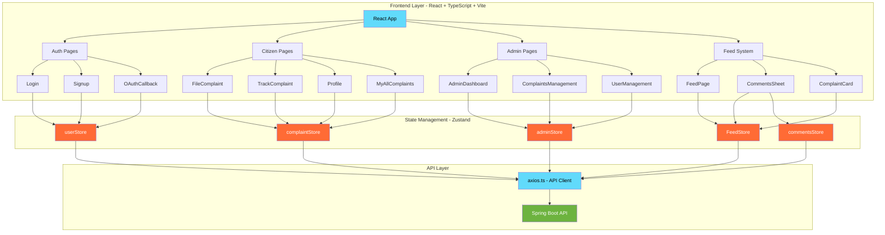
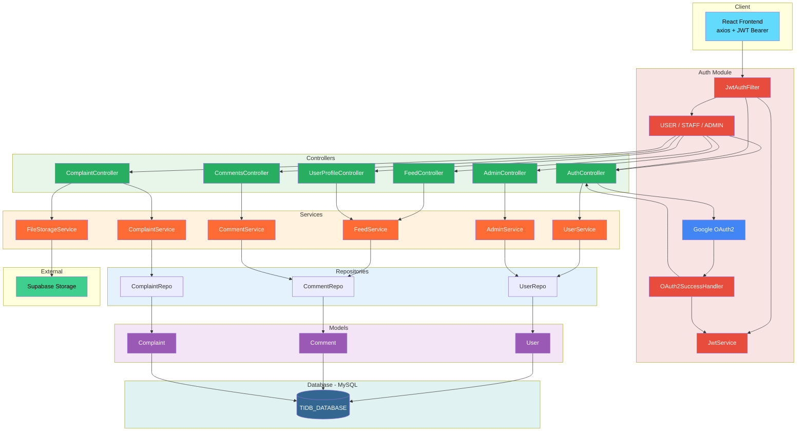
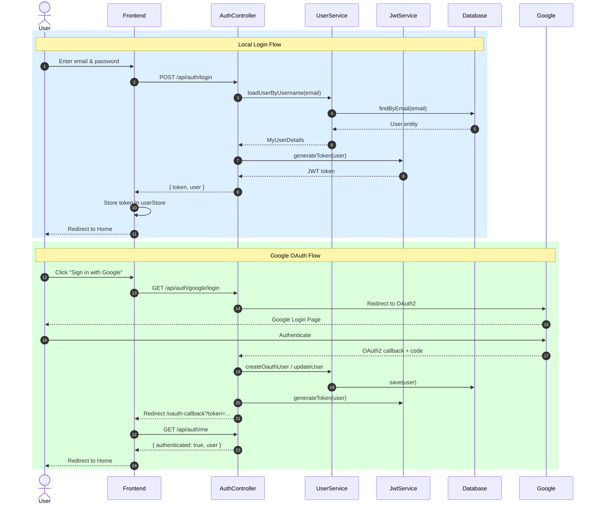
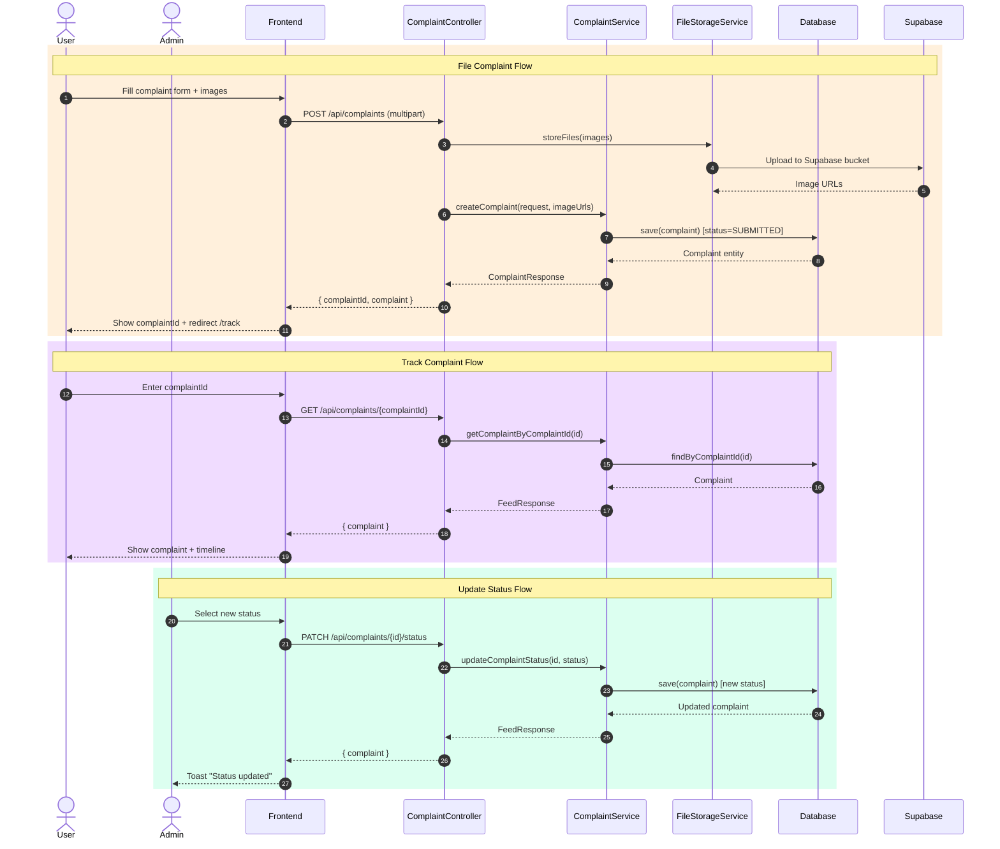

# Prajanetra

> A civic complaint management platform that connects citizens with municipal authorities to report, track, and resolve local issues.

**Live Demo:** [Deployed Project]()

---

## Overview

Prajanetra allows citizens to file geo-tagged complaints with photo evidence, track resolution status in real time, and engage through a public feed. Municipal staff and admins get a dashboard to manage complaints, update statuses, and analyse trends.

---

## Tech Stack

| Layer | Technology |
|---|---|
| Frontend | React 18, TypeScript, Vite, Tailwind CSS |
| State | Zustand |
| Backend | Spring Boot 3, Java |
| Auth | JWT + Google OAuth2 |
| Database | MySQL (TiDB) |
| Storage | Supabase Storage |

---

## Features

- **Citizens** — File complaints with images & location, track status, like/save posts
- **Feed** — Public complaint feed with filtering, sorting, and comments
- **Admin** — Dashboard with analytics, bulk actions, user & complaint management
- **Auth** — Email/password login and Google OAuth2

---

## Project Structure

```
Prajanetra/
├── PrajanetraClient/   # React + Vite frontend
└── PrajanetraServer/   # Spring Boot backend
```

---

## Getting Started

### Frontend
```bash
cd PrajanetraClient
npm install
npm run dev
```

### Backend
```bash
cd PrajanetraServer
./mvnw spring-boot:run
```

Set the required environment variables in `application.properties` (DB URL, JWT secret, OAuth credentials, Supabase keys).

---

## Architecture

### Frontend



### Backend



---

## Flows

### Authentication



### Complaint Lifecycle



---

## API Reference

| Method | Endpoint | Description |
|---|---|---|
| POST | `/api/auth/login` | Login with email/password |
| POST | `/api/auth/register` | Register new user |
| GET | `/api/auth/google/login` | Initiate Google OAuth |
| GET | `/api/auth/me` | Get current user |
| POST | `/api/complaints` | File a complaint |
| GET | `/api/complaints/{id}` | Get complaint by ID |
| PATCH | `/api/complaints/{id}/status` | Update complaint status |
| GET | `/api/feed` | Get public feed |
| GET | `/api/admin/dashboard/stats` | Admin dashboard stats |
| GET | `/api/admin/users` | List all users |

---


